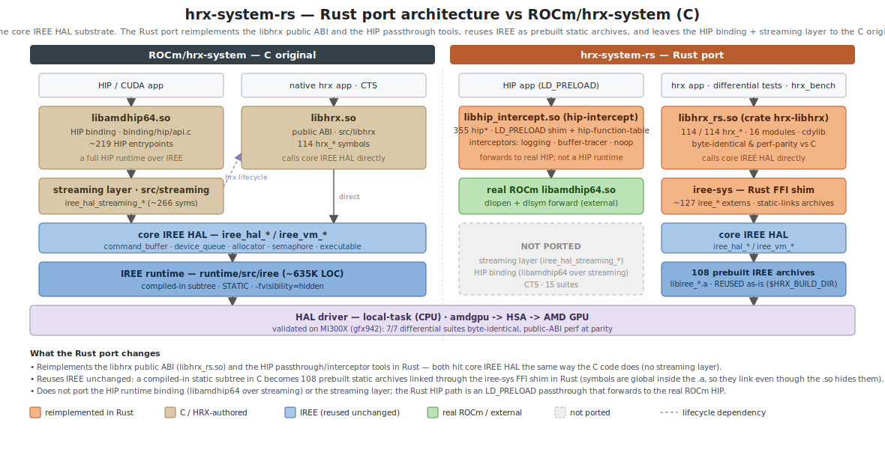

# hrx-system-rs

A Rust port of [ROCm/hrx-system](https://github.com/ROCm/hrx-system), starting
with the **LD_PRELOAD HIP passthrough/interception** layer.

See [`plans/rust-port-plan.md`](plans/rust-port-plan.md) for scope, phasing, and
the analysis of upstream.

## Architecture



`ROCm/hrx-system` builds three products on a compiled-in, hidden-visibility IREE
runtime subtree: the **libhrx public ABI** (`libhrx.so`, 114 `hrx_*`, calling
core IREE HAL directly), the **HIP binding** (`libamdhip64.so`, a full HIP
runtime layered on a separate `iree_hal_streaming_*` abstraction), and the
**HIP passthrough/interceptor** diagnostic tools. This port reimplements two of
those in Rust and reuses the IREE substrate unchanged:

- **libhrx public ABI → `libhrx_rs.so`** (crate `hrx-libhrx`): all **114/114**
  `hrx_*` symbols, calling core IREE HAL directly through the `iree-sys` FFI
  shim — exactly the C layering, with no streaming layer. Byte-identical to C on
  the 7-suite functional differential and at performance parity on MI300X
  (gfx942); see [`results/BASELINE.md`](results/BASELINE.md).
- **HIP passthrough tools → Rust** (`hip-intercept` + `hip-function-table` +
  `hip-logging` / `hip-buffer-tracer` / `hip-noop`): an `LD_PRELOAD` shim
  exporting 355 HIP symbols that forwards to the real ROCm HIP and chains
  pluggable interceptors.
- **IREE is reused unchanged**: the C build compiles it in as a static subtree;
  the Rust port links the resulting 108 prebuilt `libiree_*.a` archives through
  `iree-sys` (their symbols are global inside the archives even though the C
  `.so` hides them).

Not ported: the HIP runtime binding (`libamdhip64` over streaming) and the
`iree_hal_streaming_*` layer — the Rust HIP path forwards to the real ROCm HIP
rather than reimplementing a HIP runtime over IREE.

## Status

- **Phase 0 (baseline) — done.** The upstream C passthrough libraries build
  standalone (gcc, no ROCm/IREE), and a HIP app runs through
  `libhip_intercept.so` under `LD_PRELOAD` against a real backend
  `libamdhip64.so`, routed through the logging interceptor. This is the
  conformance oracle the Rust port is diffed against.
- **Phase 1 (Rust HIP passthrough) — done.** `hip-intercept` (355 HIP symbols)
  plus `hip-function-table` and the logging / buffer-tracer / noop interceptors
  are byte-identical to the C passthrough across the {C,Rust}×{C,Rust}
  differential matrix, validated on a live MI300X.
- **Phase 2 (Rust libhrx) — done.** `hrx-libhrx` reimplements all **114/114**
  exported `hrx_*` symbols over `iree-sys`; the 7-suite functional differential
  (`scripts/libhrx_diff_test.sh`) is byte-identical to C, and the public-ABI
  microbench is at performance parity on MI300X.

> GPU tests must run on a fine-grained-memory device (MI300X/gfx942) — see
> [GPU validation](#gpu-validation-mi300x-gfx942) — and with the Bash sandbox
> disabled (it masks `/dev/kfd`).

## Layout

```
docs/architecture.svg       architecture diagram (above)
plans/rust-port-plan.md     full plan + upstream analysis
results/BASELINE.md         HRX-vs-CLR + Rust-vs-C libhrx perf tables
crates/iree-sys             FFI shim that static-links the prebuilt IREE archives
crates/hrx-libhrx           libhrx_rs.so — the 114 hrx_* public ABI in Rust
crates/hip-intercept        libhip_intercept.so — LD_PRELOAD HIP passthrough (355 syms)
crates/hip-function-table   shared #[repr(C)] HIP interceptor ABI
crates/hip-{logging,buffer-tracer,noop}  pluggable interceptors
scripts/libhrx_diff_test.sh 7-suite C-vs-Rust functional differential (HRX_RUN_GPU=1)
scripts/bench_libhrx_parity.sh  Rust-vs-C libhrx public-ABI microbench
scripts/mi300_validate.sh   end-to-end build + validate on an MI300X host
tests/apps/                 differential test apps + hip_bench / hrx_bench
```

## Reproduce the Phase 0 baseline

Prereqs: a real `libamdhip64.so`. We use a TheRock nightly in a venv:

```bash
python3 -m venv ~/github/therock-nightly-venv
~/github/therock-nightly-venv/bin/pip install \
  --index-url https://rocm.nightlies.amd.com/v2/gfx120X-all/ "rocm[libraries,devel]"
```

Build the reference C passthrough libraries and run the LD_PRELOAD test:

```bash
HRX_SRC=~/github/hrx-system/libhrx/src bash scripts/build_c_baseline.sh
bash scripts/run_preload_test.sh \
  build/c-baseline/libhip_intercept.so build/c-baseline/libhip_logging.so
```

The harness auto-detects the backend `libamdhip64.so` from the venv (override
with `HIP_PASSTHROUGH_BACKEND_LIB`) and prints a normalized trace.

### Notes
- `hip_intercept.c` reads `HIP_INTERCEPTION_LIBRARY` for the interceptor path
  (the upstream README's `HIP_PASSTHROUGH_INTERCEPTOR` name applies to the
  separate `passthrough.c` target).
- The captured reference trace reflects a host with **0 visible GPUs**; device
  memory/kernel calls are exercised once a GPU is visible to the process. The
  C-vs-Rust differential test is environment-independent (both run side by side).

## GPU validation: MI300X (gfx942)

The local gfx1201 Radeon can't run the HRX amdgpu HAL (it exposes only a
COARSE GRAINED VRAM pool; IREE needs fine-grained device-local memory). An
MI300X exposes fine-grained GPU pools, so validation runs there.

`scripts/mi300_validate.sh` (run on an MI300 host with a TheRock `gfx94X-dcgpu`
nightly venv) builds the C reference, proves the HRX GPU/HIP product path works,
builds the Rust workspace, link-tests `iree-sys` against the freshly-built IREE
archives, and runs the Phase-1 differential matrix + buffer tracer on the real
GPU.

Verified on MI300X (8x gfx942, ROCm 7.14 nightly):
- HRX core ABI GPU path: `hrx_gpu_initialize`=0, device count 8, "AMD Instinct MI300X"
- HRX HIP product path (HRX's own libamdhip64.so): smoke app runs, count=8
- `iree-sys` static-links the 108 IREE archives and runs (allocator roundtrip)
- passthrough differential matrix: all 4 {C,Rust}×{C,Rust} combos identical,
  full device path (count=8, malloc/memcpy/memset/free)
- buffer tracer: plain/hash/hex identical, FNV-1a hashes match
